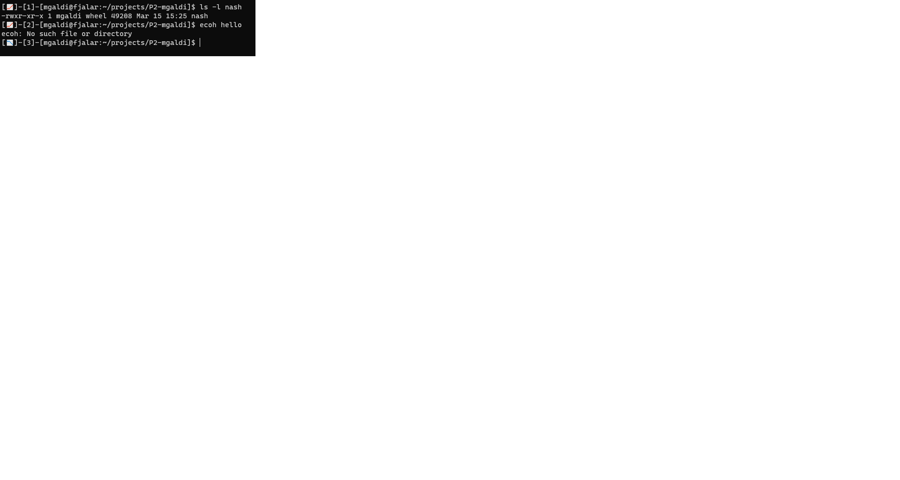

# Project 2: nash

Not A Shell is a shell which supports interactive and scripting mode. Nash executes built-in commands and external utils. List of built-in commands is present in the proper section of this readme. The shell allows us to interact with the underlying operating system through environmental variables and system calls. Some of the concepts  thare are used in this project is the use of `pipe` and `signal` handling. The shell supports piping, IO redirection, and autocomplete.

## Built-in commands

The built-in commands that come with the shell are: **cd**, **history**, **jobs**, and **exit**.

**cd**
This command changes the current working directory (`cwd`) with the use of `chdir`. After changing the current 			  	
working directory of the program,  the new `cwd` is reflected on the prompt.

**history**
This command keeps tracks of the commands that have been entered since the shell was launched. A number next to the command run indicates the count of the command when it was entered. **Note**: history keeps track only of the last 100 commands entered, however, the number that indicates the command keeps incrementing as commands are entered. Commands in the history can be executed in three different ways: **!!**, which executes the last command entered, **!num** which executes the command number indicated, and **!!prefix** which executes the command that matches the prefix indicated.

**jobs**
This command shows the background jobs currently executing. To execute a command in background, the `&` has to be at the end of the command entered. When a background job reach the end of its execution or is terminated by another process, it will disappear from the output.

**exit**
This command ends the current session with the shell. 

## Included Files

The different files included with the project are:

 - **Makefile**: used to compile and run the program.
 - **shell.c**: contains the main function and the main handlers for executing commands.
 -  **ui.c**: used for getting the input, showing the prompt, and autocompletion.
 - **history.c**: handles the command history.
 - **jobs.c**: handles the background jobs.
 - **util.c**: contains different utility functions.

Header files are included for ui.c, history.c, jobs.c and util.c.

Compile and run
```
make
./nash
```
## Prompt
The first element of the prompt indicates the status of the last command entered with an emoji. The status is followed by the command number, the current user, the hostname, and the current working directory.



